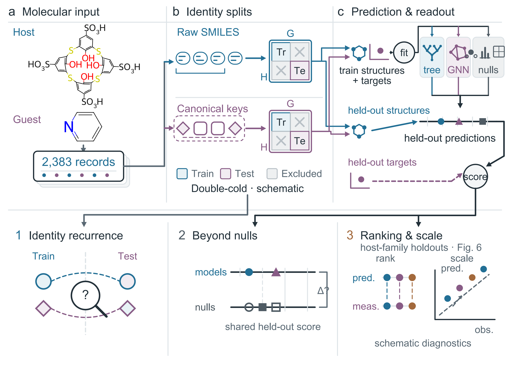

# SupraBench cold-split audit

Code, frozen evaluation inputs and saved predictions for **What cold splits test in SupraBench host–guest affinity prediction**.



The study examines 2,383 structure-valid host–guest affinity records from SupraBench. It asks what cold splits withhold, what models predict beyond matched nulls, and whether useful ranking extends to accurate absolute affinities. Released-identifier and canonical-key evaluations use different memberships and aggregations. The operational-parent sensitivity scores retained test appearances using fixed predictions.

## Verify saved results

Use Python 3.11.15 and the pinned verification environment. From the repository root:

```bash
python -m pip install -r environments/verify.txt
python scripts/verify_saved_results.py --root . --output runs/verification
```

Choose a fresh output directory. The command verifies the canonical CPU results, reaggregates all 350 saved graph-model jobs and 420 saved tree-model jobs, and replays the parent-identity sensitivity from frozen masks. Its output reports each group separately. It does not fit a model.

The input predictions, fold membership and scoring definitions are retained. Redundant combined prediction tables can be regenerated from the individual job files. Family diagnostics are supplied as saved descriptive results with their definitions; they are outside this verifier's recomputation coverage.

## Contents

| Directory | Contents |
|---|---|
| `scripts/` | Verification, reaggregation and separate training entrypoints |
| `data/` | Structure-valid records, identifiers, folds and configuration |
| `results/` | Saved canonical, graph, tree, parent-identity and family results |
| `protocols/` | Public scientific definitions and reference bindings |
| `environments/` | Pinned dependencies for verification and training |
| `docs/` | Data provenance, methods and reproduction scope |

See [data sources and transformations](docs/DATA_SOURCES.md), [reproduction scope](docs/REPRODUCTION.md), and the [selected figures](figures/README.md). Frozen tree features accompany the tree results.

## Interpretation

Host-cold and guest-cold comparisons pool held-out predictions. Double-cold results may use pooled scores or equally weighted block margins as specified by each result table; these summaries are not interchangeable. Null models use the same scoring populations and the stated metric guards.

The parent-identity analysis preserves the original fits and changes the scored test population. Its operational decisions are representation rules, not adjudications of experimental chemical equivalence. The primary scenario retains strict identities for three uncertain groups. This sensitivity does not estimate performance after parent-disjoint retraining.

## Separate training workflow

Training uses the frozen jobs, splits and inputs. Full graph jobs require the pinned PyTorch/PyG environment and CUDA; tree jobs use the tree requirements. Training has a materially different runtime and resource cost from saved-result verification. The original graph preparation has an unavailable pilot-source record, and new training is not guaranteed to reproduce historical outputs bit for bit. Frozen tree features are supplied because their original 3D preparation used a wall-clock cutoff.

Install the corresponding requirements in a suitable separate environment. The graph requirements use the official CUDA 12.8 PyTorch package index. Check one frozen job without fitting:

```bash
python -m pip install -r environments/trees.txt
python scripts/run_trees_public.py --repo-root . --output runs/tree_check --job-id s0_b8_PAIR_RF --dry-run

python -m pip install -r environments/gnn.txt
python scripts/run_gnn_public.py --repo-root . --output runs/gnn_check --job-id s1_double_cold_11_GINE --dry-run
```

To train that complete job, omit `--dry-run` and choose a fresh output directory. Use `--all` instead of `--job-id` only when prepared to run the full suite. The public packaging check uses saved predictions and training dry-runs; it does not rerun the full training suites.

## Data and licensing

The records originate from [SupraBench](https://github.com/Tianyi-Billy-Ma/SupraBench), including [SupraBank](https://suprabank.org/) records. The relevant upstream code and curated data are distributed under [CC BY 4.0](https://creativecommons.org/licenses/by/4.0/). This repository retains that attribution and identifies its processing changes. Full-text literature and upstream molecular-coordinate archives are not needed for the saved-prediction checks.

The original analysis code identified in [FILE_LICENSES.tsv](FILE_LICENSES.tsv) is MIT licensed. Data and third-party materials have their own stated terms. See [LICENSING.md](LICENSING.md), [THIRD_PARTY.md](THIRD_PARTY.md), and the data-source description.

## Citation

Please cite the upstream SupraBench resource and identify this repository and the commit used. The manuscript title is *What cold splits test in SupraBench host–guest affinity prediction*. No manuscript DOI or archival DOI is assigned by this repository.
